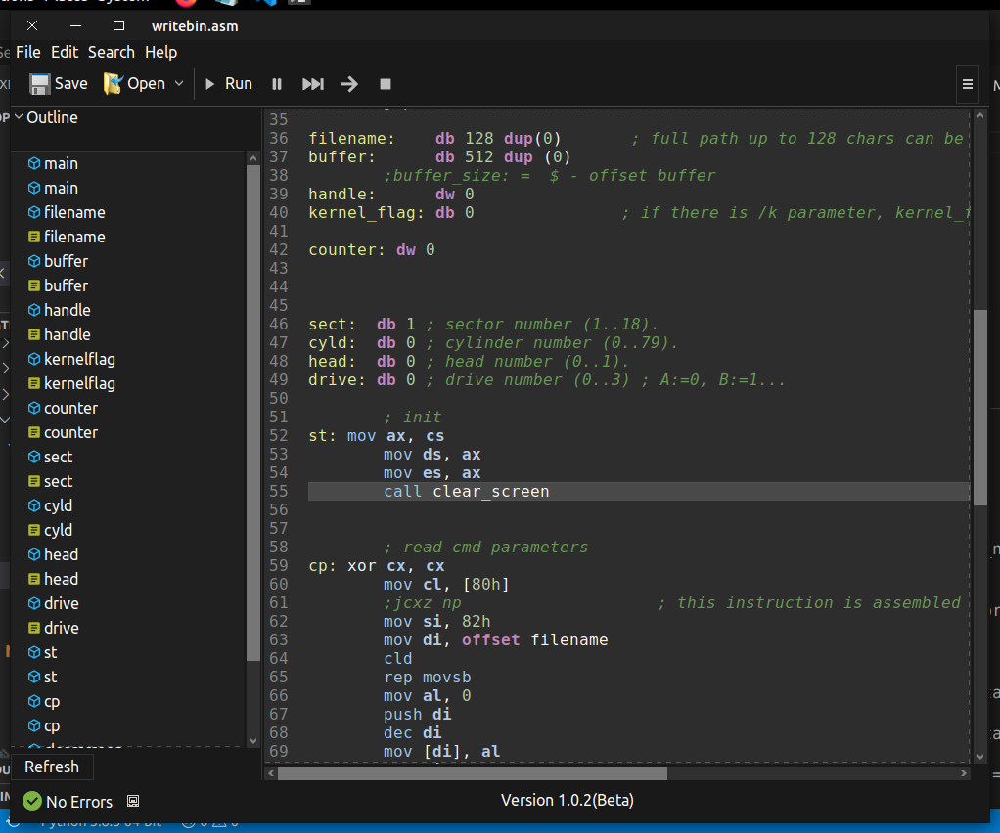

# gtkemu8086

## An 8086 emulator (in progress)

> The product is still in development and is a hobby project

**This is article detailing this project**

## What is this

This is a github repo containing source code of an 8086 emulator written in C that is currently in the works.
View the documentation [here](https://kosiken.github.io/gtkemu8086-docs)

## Screenshot

## Motivation

One of the things I fell in love with while studying computer engineering ( in a school I would not mention) was processors. I read on them, I studied their operation, I thought maybe someone should write an easier to use emulator that isn't over 600mb to download and doesn't make my laptop a hot plate capable of boiling a kettle of tea.

### Attribution

The assembler code is modified from [here](https://github.com/nanochess/tinyasm)

## About

Allison Kosy is a developer who primarily writes react and react native applications but is involved in embedded systems and penetration testing in his free time

- Twitter [@kosisoali](https://twitter.com/kosisoali)
- Instagram [@allisonkosy](https://instagram.com/allisonkosy)
- Telegram [@allisonkosy](https://t.me/allisonkosy)

**Copyright 2020 KRC**

